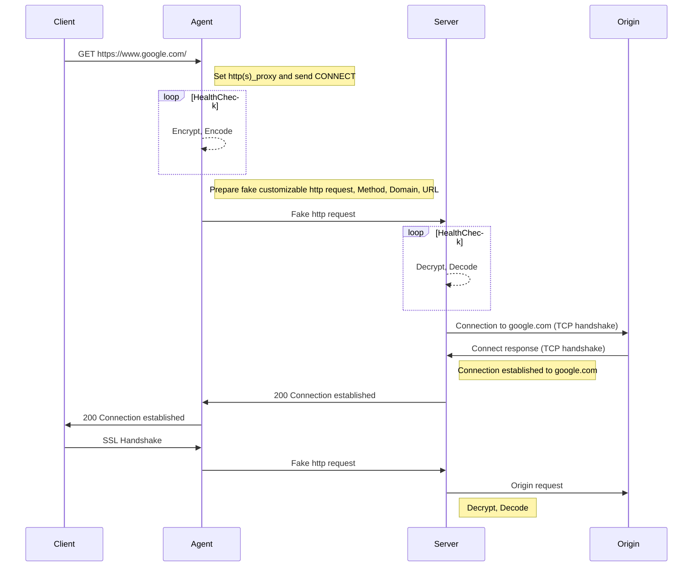

# NipoVPN
A powerfull proxy to hide your http packets inside a fake http request.

```mermaid
sequenceDiagram
Client ->> Agent: GET https://www.google.com/ 
Note right of Agent: Set http(s)_proxy and send CONNECT
loop HealthCheck
    Agent-->>Agent: Encrypt, Encode
end
Note right of Agent: Prepare fake customizable http request, Method, Domain, URL

Agent ->> Server: Fake http request
loop HealthCheck
    Server-->>Server: Decrypt, Decode
end
Server ->> Origin: Connection to google.com (TCP handshake)
Origin ->> Server: Connect response (TCP handshake)
Note right of Server: Connection established to google.com
Server ->> Agent: 200 Connection established
Agent ->> Client: 200 Connection established
Client ->> Agent: SSL Handshake
Agent ->> Server: Fake http request
Server ->> Origin: Origin request
Note right of Server: Decrypt, Decode


```
